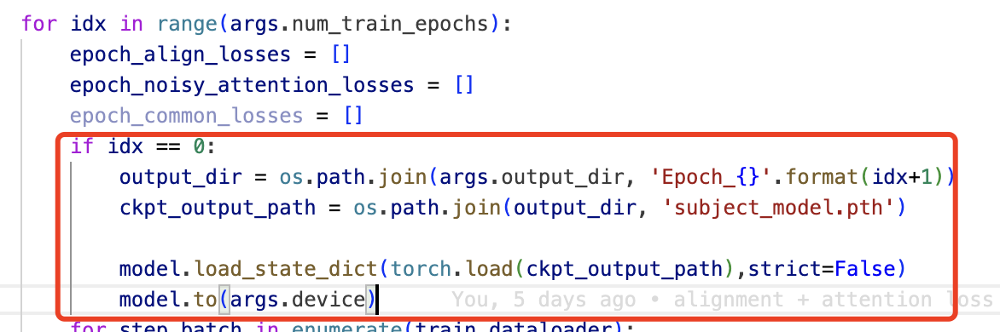
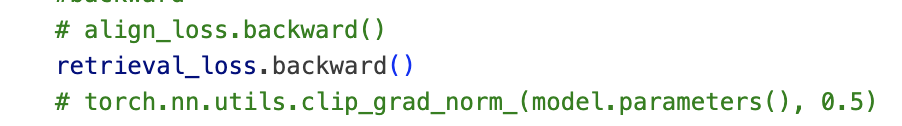
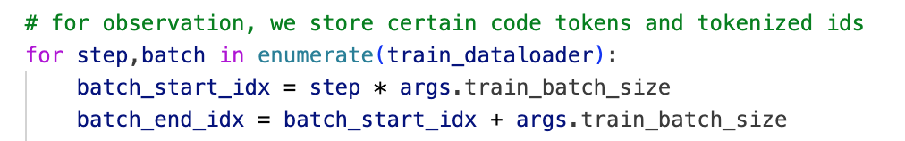
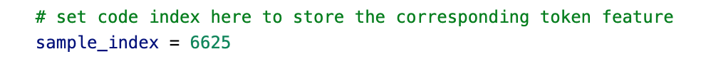

# Code Search

在 cd 到当前文件夹后，可以用指令 bash train.sh 运行代码

观察valid dataset 上的 case study example 有以下几个步骤

1. 训练模型，由预训练的graphcodebert或者自己已有的模型出发（目前代码是根据一个训练过的模型，如果要利用预训练模型直接训练，把下列部分注释掉即可）
    根据控制变量法，我们会在同样的数据集上进行 retrieval loss， 以及 retrieval loss + alignement loss + attention loss 的对比，为了训练这两种模型，需要调用main中的train_alignment_sample(args, model, tokenizer, pool)函数，并且只需在这里选择是retrieval loss或者是 aa loss 即可，并在后面修改当前训练方法得到的模型权重保存的路径

2. save valid dataset features
    为了方便观察，我们共需要存储 三种类型的 features， cls token embedding， all tokens embedding， cls token attention
    要存储 comments 的这三种features，只需要在 main 中调用 save_valid_attention_features(args, model, tokenizer, pool) （注意：存储不同的训练方法的模型得到的 embedding 的时候记得更改模型读取路径）
    存储 code 的三种features 会有些麻烦，由于code all tokens embedding 太大（42000，320，768）不能直接一次性存储，因此，我们首先注释掉 save_valid_code_attention_features 和 save_valid_code_attention_features_aa 中  for observation 注释 之后的部分，从而只存储 cls token embedding 和 cls token attention，在之后，根据我们要观察的code 的index， 单独存储当前code的 all tokens embeddings，这一步需要注释掉 for first run 和 for observation 注释 之间的部分，只运行for observation部分代码，并且在 sample index 处改成自己需要存储的code embedding index

3. 存储好所有的embeddings 之后，可以根据两个jupyter文件进行观察，jupyter文件中会计算 两种模型下，哪些样本的表现变好，哪些样本的表现变差，并计算出指定样本的comment所对应的code index，方便生成对应的code tokens embedding。并且jupyter会自动生成工具所需要的 所有二维坐标，tokens label等信息，方便利用工具观察 （建议用能正常启动工具的conda 环境运行这两个jupyter文件）